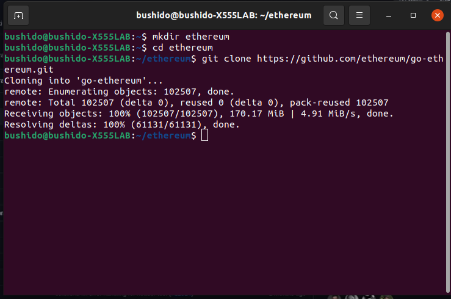
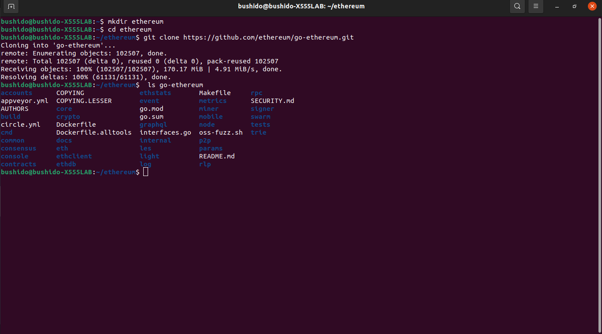
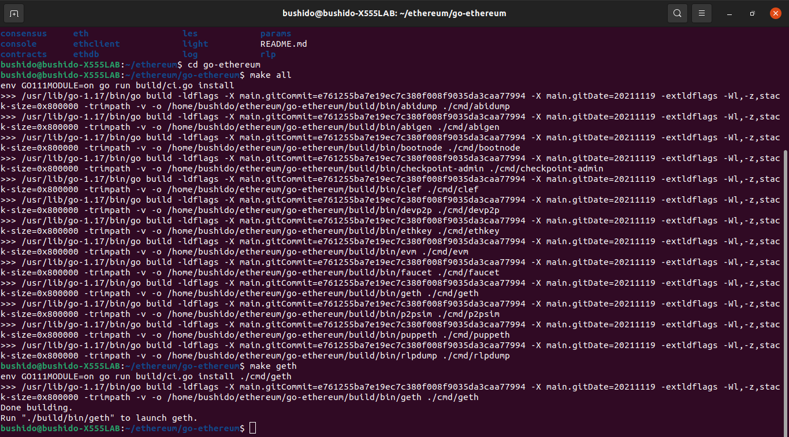

<h1 align="center"> Interacting with the Ethereum platform </h1>

<h4 align="center"> 
	🚧  goBlockchain 🚀 Under construction...  🚧
</h4>

<p align="center"></p>

<!--ts-->
* [What is Ethereum](#what-is-ethereum)                            
* [Pre requirements](pre-requirements)
 * [How to install the geth client](#how-to-install-the-geth-client)
 * [How to set up and run a full Ethereum node](how-to-set-up-and-run-a-full-Ethereum-node)
      * [How to run a network on testnet](#how-to-run-a-network-on-testnet)
      * [How to run on private network](#how-to-run-on-private-network)
      * [How to create a local account](#how-to-create-a-local-account)
* [How to connect metasmask to a local network](#how-to-connect-metasmask-to-a-local-network)
* [How to connect remix editor to geth private network](#how-to-connect-remix-editor-to-geth-private-network)
* [Emulators](#emulators)
   * [Ganache](#ganache)
   * [Infura](#infura)
   * [Procurar](#procurar)
* [License](#License)
* [Contribution](#contribution)
* [Autor](#autor)
  
<!--te-->

# What is Ethereum

<h3> Ethereum is a decentralized platform, in which its purpose is to create applications and smart contracts.</h3>
<h3>In addition, its applications are fully proof of censorship, fraud or interference from third parties. Giving security to users of this technology. All blocks that keep your information are also available to all users so that each one can have their own copy, guaranteeing the immutability of all applications on the network. </h3>


# ✅ Pre requirements


Before starting, you will need to have the following tool installed on your machine:

[VSCode](https://code.visualstudio.com/)

[Geth](https://geth.ethereum.org/downloads/)

[Infura](https://infura.io/)

[Ganache](https://www.trufflesuite.com/ganache)


# 🛠  How to install the Geth client

<p>We will be using the linux system in the application of this system, if by chance you are using Windows or MacOS system I will leave an <a href = "https://geth.ethereum.org/docs/install-and-build/installing-geth#install -on-ubuntu-via-ppas ">( link )</a> for activating other software, it is worth checking to see if you hear system updates that may affect the installation because they are using codes that are no longer included by the system  </p>

### Open your terminal "control + alt + t" to enable our launchpad repository run: 

```bash
   sudo apt-get install software-properties-common
```

## Install on Arch Linux via pacman 

The geth package is available from the <a href="https://archlinux.org/packages/community/x86_64/go-ethereum/">community repo. </a>

<p>You can install it using:</p>

```bash
   pacman -S geth
```

<p>THE abigen, bootnode, clef, evm, geth, puppeth, rlpdump, and wnode commands are then available on your system in /usr/bin/.</p>

<p>Find the different options and commands available with</p> 

```bash
   geth --help
```

# How to set up and run a full Ethereum node

<p> I will leave the <a href="https://github.com/ethereum/go-ethereum"> ( link )  </a> dthe directory for update reasons </p>

<p> Always remember to create a folder so you can delete later more easily </p>

<p> Open your terminal (control + alt + t ) and use these commands </p>

<p> Add this code plus the name of the folder you want to create for example: ( code below + ethereum ) you will be creating a folder with this name </p>

```bash
  mkdir ethereum
```

<p> After creating the folder type this code ( cd + the name of the folder you created, in our example we use the name as ethereum ) to be able to add the repositories </p>

```bash
   cd ethereum 
```
<p> Now paste these codes to download all the repositories needed for the test </p> 

```bash
   git clone https://github.com/ethereum/go-ethereum.git
```



<p>A folder called go-ethereum was created, to check if the files were actually created and cloned, enter the code below to check if everything is ok </p>

```bash
    ls go-ethereum
```



<p> After confirming the creation, we will enter using the code "cd" so that we can interact within it: </p>

```bash
   cd go-ethereum
```

<p> Let's compile all this may take a while type the code below </p>

```bash
   make all
```
<p> After compiling type the next code to check if everything is ok: </p>

```bash 
   make geth
```

<p> Check if your code is like this: </p>




<p> To run type </p>

```bash
   ./build/bin/geth
```
<p> Ready! you have just become a node in the ethereum system- DON'T FORGET TO STOP THE RUN CLICK THE BUTTON ( CONTROL + C ) as this type of system downloads blockchain data and can take up considerable memory space on your hard drive </p>

## How to run a network on testnet

## How to run on private network

## How to create a local account

# How to connect metasmask to a local network

# How to connect remix editor to geth private network

# Emulators

## Ganashe

## Infura

## Procurar


```bash 

```

# License

Copyright (c) <2021> <Seu Nome> Allan Azevedo

Permission is hereby granted, free of charge, to any person obtaining a copy
of this software and associated documentation files (the "Software"), to deal
in the Software without restriction, including without limitation the rights
to use, copy, modify, merge, publish, distribute, sublicense, and/or sell
copies of the Software, and to permit persons to whom the Software is
furnished to do so, subject to the following conditions:

The above copyright notice and this permission notice shall be included in all
copies or substantial portions of the Software.

THE SOFTWARE IS PROVIDED "AS IS", WITHOUT WARRANTY OF ANY KIND, EXPRESS OR
IMPLIED, INCLUDING BUT NOT LIMITED TO THE WARRANTIES OF MERCHANTABILITY,
FITNESS FOR A PARTICULAR PURPOSE AND NONINFRINGEMENT. IN NO EVENT SHALL THE
AUTHORS OR COPYRIGHT HOLDERS BE LIABLE FOR ANY CLAIM, DAMAGES OR OTHER
LIABILITY, WHETHER IN AN ACTION OF CONTRACT, TORT OR OTHERWISE, ARISING FROM,
OUT OF OR IN CONNECTION WITH THE SOFTWARE OR THE USE OR OTHER DEALINGS IN THE
SOFTWARE.

# ✅ Contribution


[Henrique Leite](https://github.com/falehenrique/)

[Wallace Azevedo](https://github.com/wallaceAzevedo/)

[Caio Sá](https://github.com/caiosabarros/)

[goBlockchain](https://github.com/goblockchain/)


# Autor

[Allan Azevedo](https://www.linkedin.com/in/allan-azevedo-7908b21b5//)

